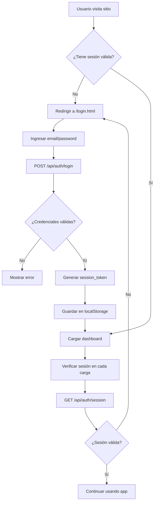

# Sistema de Autenticación v2.0 - Documentación de Implementación

## Fecha de Implementación
20 de Enero de 2026

## Resumen
Se implementó un sistema de autenticación básico con email/password para proteger el acceso al dashboard de Snifer. Todos los usuarios deben iniciar sesión para acceder a las funcionalidades del sistema.

---

## 🎯 Objetivos Alcanzados

- ✅ Login con email y contraseña
- ✅ Sesiones persistentes (7 días)
- ✅ Protección de todas las páginas (Dashboard, Visor, Panel de Nodos)
- ✅ Sistema de roles (Admin, Contributor, User)
- ✅ Logout funcional
- ✅ Interfaz de usuario moderna con glassmorphism

---

## 📁 Archivos Creados

### Frontend
- **`login.html`** - Página de inicio de sesión con diseño moderno
- **`js/auth.js`** - Librería de autenticación del lado del cliente
  - Funciones: `checkAuth()`, `logout()`, `authFetch()`, `canEdit()`, `isAdmin()`

### Backend (API)
- **`api/auth/login.js`** - Endpoint de autenticación
- **`api/auth/logout.js`** - Endpoint de cierre de sesión
- **`api/auth/session.js`** - Validación de sesiones activas

### Base de Datos
- **`api/db/init_auth.sql`** - Schema de tablas de autenticación
  - Tabla `users` - Almacena usuarios del sistema
  - Tabla `sessions` - Gestión de sesiones activas
  - Modificaciones a `mac_aliases` (agregado `user_id`, `is_global`)

### Utilidades
- **`generate-hash.js`** - Script para generar hashes de contraseñas
- **`create-admin.js`** - Script para crear usuarios admin (requiere env vars)

---

## 🗄️ Esquema de Base de Datos

### Tabla: `users`
```sql
CREATE TABLE users (
    id SERIAL PRIMARY KEY,
    email VARCHAR(100) UNIQUE NOT NULL,
    username VARCHAR(50),
    password_hash VARCHAR(255) NOT NULL,
    role VARCHAR(20) DEFAULT 'user', -- 'admin', 'contributor', 'user'
    created_at TIMESTAMP DEFAULT NOW(),
    last_login TIMESTAMP,
    is_active BOOLEAN DEFAULT true
);
```

### Tabla: `sessions`
```sql
CREATE TABLE sessions (
    id SERIAL PRIMARY KEY,
    user_id INTEGER REFERENCES users(id) ON DELETE CASCADE,
    session_token VARCHAR(500) UNIQUE NOT NULL,
    expires_at TIMESTAMP NOT NULL,
    created_at TIMESTAMP DEFAULT NOW()
);
```

### Modificaciones a `mac_aliases`
```sql
ALTER TABLE mac_aliases 
    ADD COLUMN user_id INTEGER REFERENCES users(id) ON DELETE SET NULL,
    ADD COLUMN is_global BOOLEAN DEFAULT false,
    ADD COLUMN created_at TIMESTAMP DEFAULT NOW();
```

---

## 🔐 Roles y Permisos

| Rol | Permisos |
|-----|----------|
| **Admin** | Acceso total, gestión de usuarios, alias globales |
| **Contributor** | Lectura + edición de alias locales y globales |
| **User** | Solo lectura, no puede editar |

> **Nota:** La lógica de permisos está implementada en el frontend (`js/auth.js`) pero aún no está integrada en los endpoints de edición de alias.

---

## 🚀 Pasos de Implementación Realizados

### 1. Instalación de Dependencias
```bash
npm install bcryptjs
```

### 2. Creación del Schema de Base de Datos
Ejecutado en Neon SQL Editor:
```bash
psql <connection-string> -f api/db/init_auth.sql
```

**Resultado:**
```
CREATE TABLE
CREATE TABLE
ALTER TABLE
CREATE INDEX (x4)
INSERT 0 1
CREATE FUNCTION
```

### 3. Creación del Usuario Admin
Generación del hash de contraseña:
```bash
node generate-hash.js THEmachine
```

Inserción en la base de datos (Neon SQL Editor):
```sql
INSERT INTO users (email, username, password_hash, role, is_active)
VALUES ('elnona@gmail.com', 'oscar', '$2b$10$xc/9kjSUdGD.4tpnP09pF.vXBHU/46obnXIIgLzfOEj9Vp0Npmmcq', 'admin', true);
```

### 4. Modificación de Páginas Existentes
Se agregó protección de autenticación a:
- `index.html` - Dashboard principal
- `visor.html` - Visor temporal-espacial
- `nodos.html` - Panel de control de nodos

**Cambios aplicados:**
```html
<!-- En el <head> -->
<script src="/js/auth.js"></script>

<!-- En window.onload -->
window.onload = async () => {
    const user = await checkAuth();
    if (!user) return; // Redirige a login
    
    // Continuar con lógica normal...
}
```

### 5. Despliegue a Vercel
```bash
vercel --prod
```

---

## 🔧 Uso del Sistema

### Para Usuarios Finales

**Login:**
1. Ir a `https://snifer.vercel.app/login.html`
2. Ingresar email y contraseña
3. Hacer clic en "Iniciar Sesión"
4. Serás redirigido al dashboard

**Logout:**
- Hacer clic en el botón "🚪 Salir" en el header de cualquier página

### Para Administradores

**Crear un nuevo usuario:**
1. Generar hash de contraseña:
   ```bash
   node generate-hash.js <contraseña-deseada>
   ```

2. Ejecutar SQL en Neon Console:
   ```sql
   INSERT INTO users (email, username, password_hash, role, is_active)
   VALUES ('email@ejemplo.com', 'Nombre', '<hash-generado>', 'user', true);
   ```

**Cambiar rol de usuario:**
```sql
UPDATE users SET role = 'admin' WHERE email = 'email@ejemplo.com';
```

**Desactivar usuario:**
```sql
UPDATE users SET is_active = false WHERE email = 'email@ejemplo.com';
```

---

## 🔍 Flujo de Autenticación



---

## 🛠️ Tecnologías Utilizadas

- **bcryptjs** - Hashing de contraseñas (10 rounds)
- **@vercel/postgres** - Conexión a base de datos Neon
- **localStorage** - Almacenamiento de tokens de sesión
- **Crypto (Node.js)** - Generación de tokens aleatorios
- **Vercel Serverless Functions** - Hosting de API endpoints

---

## 📝 Notas Importantes

### Seguridad
- ✅ Contraseñas hasheadas con bcrypt (nunca en texto plano)
- ✅ Tokens de sesión aleatorios (32 bytes hex)
- ✅ Sesiones con expiración (7 días)
- ✅ Validación de sesión en cada request
- ✅ HTTPS obligatorio (Vercel)
- ⚠️ **Pendiente:** Rate limiting en login
- ⚠️ **Pendiente:** Recuperación de contraseña por email

### Base de Datos
- La base de datos usada es **Neon** (no Vercel Postgres nativo)
- Acceso al SQL Editor: `https://console.neon.tech`
- Connection string almacenado en variables de entorno de Vercel

### Limitaciones Actuales
1. No hay registro de usuarios (solo admin puede crear)
2. No hay recuperación de contraseña
3. No hay Google OAuth (planeado para futuro)
4. Los permisos de roles no están aplicados en los endpoints de edición

---

## 🚧 Próximos Pasos (Roadmap)

### Fase 2: Permisos y Alias
- [ ] Modificar `/api/mac_profile` para respetar `user_id`
- [ ] Implementar alias locales vs globales
- [ ] Restringir edición según rol del usuario

### Fase 3: Panel de Administración
- [ ] Crear `admin.html` para gestión de usuarios
- [ ] Endpoint `/api/admin/users` (GET, PATCH, DELETE)
- [ ] UI para cambiar roles y eliminar usuarios

### Fase 4: Mejoras de Seguridad
- [ ] Google OAuth
- [ ] Recuperación de contraseña por email
- [ ] Rate limiting en login
- [ ] Registro de auditoría (logs de acciones)

---

## 🐛 Troubleshooting

### "Sesión inválida o expirada"
- El token expiró (7 días)
- Hacer logout y volver a iniciar sesión

### "Error cargando mapa vectorial"
- Error no relacionado con autenticación
- Problema con Overpass API (revertido en v1.7.11)

### No puedo crear usuarios desde `create-admin.js`
- El script requiere variables de entorno de Vercel
- Usar `generate-hash.js` + SQL manual en Neon Console

---

## 📞 Contacto y Soporte

Para problemas o preguntas sobre el sistema de autenticación:
- Revisar logs en Vercel Dashboard
- Verificar sesiones en tabla `sessions` de la DB
- Consultar este documento

---

**Versión:** 2.0  
**Última actualización:** 20 de Enero de 2026  
**Autor:** Sistema de Autenticación Snifer
